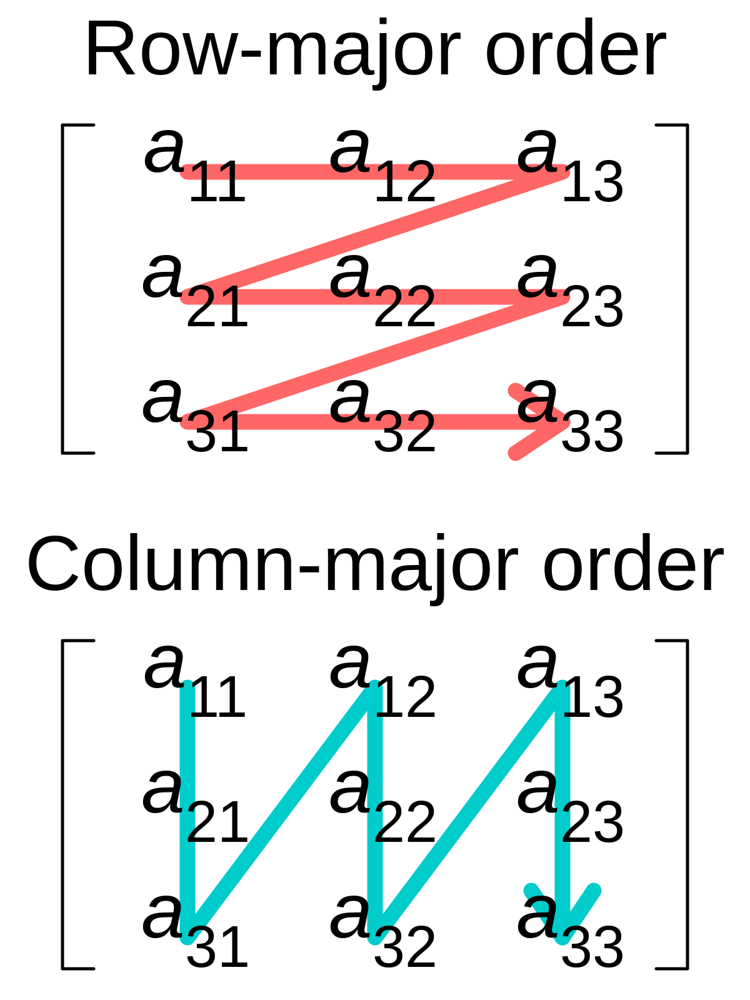

# FPGA Accelerated Thread Art

## Project Introduction
We create a parallel implementation of "thread art" algorithm that simulates rendering an image by wrapping single piece of string around hooks placed in a circle.

<div align="center">
  <figure>
    
    <figcaption>Example Execution Progress</figcaption>
  </figure>
  <figure style="display: inline-block;">
    
    <figcaption>20%</figcaption>
  </figure>
  <figure style="display: inline-block;">
    
    <figcaption>40%</figcaption>
  </figure>
  <figure style="display: inline-block;">
    
    <figcaption>60%</figcaption>
  </figure>
  <figure style="display: inline-block;">
    
    <figcaption>80%</figcaption>
  </figure>
  <figure style="display: inline-block;">
    
    <figcaption>100%</figcaption>
  </figure>
  <figure style="display: inline-block;">
    
    <figcaption>ref</figcaption>
  </figure>
</div>


## High Level Design
### Line Choice
The final design utilizes a simplified version of the algorithm from [this](https://github.com/callummcdougall/computational-thread-art) github repository. 

There are many similar implementations, but the optimizations introduced by the author of this github repository resulted in better quality images.  

At a high level, all the different algorithms aim to try possible lines from a given starting hook, and pick the resulting line that results in greatest similarity to the original image.  

In order to compute similarity, a penalty is formally defined below as:  


For ease of computation, images are first inverted, with 255 representing complete darkness, and 0 representing complete brightness. 

A paramterized value *LINE DARKNESS* set as 150 by default represents the darkness of a line. If a line is drawn through a sets of points, all points in the set have their inverted pixel value subtracted by 150.

***p<sub>i</sub>*** represents the inverted pixel value.

***w<sub>i</sub>*** represents the corresponding weight value, which applies a multiplier between 0 and 1, allowing for some pixels to contribute more to overall penalty and therefore be prioritized. 

***L*** represents the lightness penalty, another value between 0 and 1 that allows for negative values to contribute less to overall penalty, therefore increasing the algorithms willingness to draw more lines.

At each step, the algorithm computes possible lines from a starting point and calculates the penalty through those points with (pixel values subtracted by *LINE DARKNESS*) and without (original pixel values). It then selects the line the reduces the penalty by the greatest amount. 

From there, the chosen point becomes the starting point at the next step, and the process is repeated for either a predetermined number, or until no line will result in reduction of penalty. 

In testing, it was found to be easier to just run for a predetermined number of lines multiple times to simplify the logic.

This results a O(N^2) problem, where N is number of hooks. This is slow, but there is a large amount of parallelism because each line's calculation does not depend on any other lines. Provided the necessary memory bandwidth, the image values of points along each line can be read in parallel, allowing for parallel penalty computation. 

Furthermore, it is not necessary to consider every other hook from a starting hook. The image quality does not diminish if a suitable random subset of the hooks are considered at each step. In our testing, only considering half of the total number of hooks available did not result in any difference in image quality. The result of this optimization is time saving in a software implementation and space saving in a hardware implementation. A python-styled psuedocode implementation is shown below

```python
hook_list = generate_hook_list() # list containing (x,y) tuples representing hooks
starting_hook = hook_list[rand()] # start from random hook
cur_hook = starting_hook
result = []
for (i in range(NUM_LINES)):
  chosen = generate_randoms(hook_list, TIME_SAVER) # consider TIME_SAVER hooks
  best_reduction = Integer.MIN
  chosen_hook
  for (hook in chosen): # iterate through chosen hooks
    if calculate_reduction(cur_hook, hook)  > best_reduction:
      best_reduction = calculate_reduction(starting_hook, hook)
      chosen_hook = hook
  # subtract DARKNESS value from points that the best line goes through 
  update_image() 
  result.append ((cur_hook, chosen_hook)) # add hook tuple to result list
  cur_hook = chosen_hook
```

### Bresenham
<div align="center">
  <figure>
    
    <figcaption>Visualization</figcaption>
  </figure>
</div>
One important piece of this algorithm that has not yet been discussed is the calculation of pixels through two pixels. In order to avoid the speed penalty associated with the usage floating point numbers, the Bresenham Line Algorithm is utilized.

The key concept of Bresenham's line algorithm is that it keeps a accumlating error term that decides whether to increment the x coordinate, the y coordinate, or both.

The Bresenham algorithm can be outlined as follows:

1. The difference between the start and end points on both axes (dx, dy) is calculated.

2. The error err is initially set to dx - dy. If dx is greater than dy, then err is positive, and the line is more horizontal than vertical. If dy is greater than dx, then err is negative, and the line is more vertical than horizontal.

3. For each step along the line, the algorithm decides whether to increment the x-coordinate, the y-coordinate, or both, based on the error term.

4. The variable e2 is set to 2 \* err. This is done because the algorithm compares 2\*err with dx and -dy, instead of comparing err with 0.5 \* dx and -0.5 \* dy, which would require floating-point arithmetic. The reason we use the e2 term is explained below: 

   Consider an arbitrary point (x,y) on the line, and suppose this point is represented by a pixel in the rasterization. Let y = mx + b be the equation of the line, where m is the slope. Note that m = dy/dx. Because (x,y) is on the line, we know that y = mx + b. Let e be the error term at (x,y). By definition, e is twice the vertical distance between the line at (x+1) and the midpoint between the pixels at (x+1, y) and (x+1, y+1). The y-coordinate of the line at x+1 is m*(x+1) + b. The y-coordinate of the midpoint is y + 0.5. So the vertical distance is m*(x+1) + b - (y + 0.5), and e = 2\*(m\*(x+1) + b - y - 0.5). Substitute y = mx + b into the equation for e, and we get e = 2\*[(m\*(x+1) + b) - (mx + b) - 0.5] = 2m.
   The [wikipedia](https://en.wikipedia.org/wiki/Bresenham%27s_line_algorithm) article provides further explanation for this.

5. Now, the decision comes down to comparing e2 > -dy, e2 < dx and e2 == dx. 

   e2 > -dy: When the error is greater than -dy, it means the line is above the midpoint between the two potential candidate pixels. So, the algorithm selects the pixel on the "right", i.e., increments in the x-direction (x0 += sx) and the error err is updated (err -= dy). 

   e2 < dx: When the error is less than dx, it means the line is below the midpoint between the two potential candidate pixels. So, the algorithm selects the pixel "above", i.e., increments in the y-direction (y0 += sy) and the error err is updated again (err += dx).

   e2 == dx: In this case, the algorithm needs to move diagonally, which it does by moving one step in both the x and y directions.

6. Once the endpoints are reached, the algorithm terminates.

Below is a python styled psuedocode implementation.
```python
x0, y0 = p0.x, p0.y
x1, y1 = p1.x, p1.y
dx = abs(x1 - x0)
dy = abs(y1 - y0)

sx = 1 if x0 < x1 else -1
sy = 1 if y0 < y1 else -1

err = dx - dy

while True:
    point = (x0, y0)
    pixels.append(point)

    if (x0, y0) == (x1, y1):
        return

    e2 = 2 * err

    if e2 > -dy:
        err -= dy
        x0 += sx

    if e2 < dx:
        err += dx
        y0 += sy

    if e2 == dx:
        err -= dy;
        x0 += sx;
        err += dx;
        y0 += sy;
```
With these two components, the full algorithm can be realized, and we first created a sequential C implementation to better understand the algorithm and provide a baseline to compare against. The final output is a list of point pair connections that can then be drawn onto the VGA using the draw line function, or read using a Python script for saving as an image.

As far as we know, there are no existing patents for this algorithm.


## Program/hardware design
### Communication
In order to take advantage of each platforms inherent advantages, we divided the work between the ARM and the FPGA. The first step to dividing the work is a reliable data transfer protocol between the ARM and the FPGA.

When ARM sending data to FPGA

sequenceDiagram
    ARM->>FPGA: ARM_VAL
    FPGA-->>ARM: FPGA_ACK
    ARM-)FPGA: ARM_DATA



When FPGA sending data to ARM

sequenceDiagram
    FPGA->>ARM: FPGA_VAL
    ARM-->>FPGA: ARM_ACK
    FPGA-)ARM: FPGA_DATA


After sending a valid transaction, the sender waits for the ACK, and then drops their VAL signal. The reciever asserts their ACK until the VAL drops again, and then drops their ACK.

All communication between the ARM and the FPGA is handled using this scheme.

### High Level View

With this protocol defined, a high level state diagram of the design is illustrated below:


stateDiagram
    State1: ARM write image data to FPGA
    State2: ARM calculate (x,y) values of all hooks
    State3: ARM choose starting hook randomly, sets as cur point
    State4: ARM randomly choose N_SOLVER endpoints
    note right of State8
      Repeat Sequence NUM_LINES times
    end note
    State5: ARM write [(starting point), (ending point)] pairs to FPGA solvers
    State6: ARM wait for FPGA solvers to finish computation
    State7: ARM recieve best endpoint from FPGA, sets as cur point
    State8: ARM write updated image data to FPGA
    State1 --> State2
    State2 --> State3
    State3 --> State4
    State4 --> State5
    State5 --> State6
    State6 --> State7
    State7 --> State8
    State8 --> State4

The FPGA is only used for penalty computation.

As the ARM gets best endpoints, it saves them in a list that is later written out as txt/csv file.

### Solver Unit
<div align="center">
  <figure>
    
    <figcaption> Solver Compute State Connections</figcaption>
  </figure>
</div>

<div align="center">
  <figure>
    
    <figcaption> Solver FSM</figcaption>
  </figure>
</div>

### Bresenham Unit
<div align="center">
  <figure>
    
    <figcaption> Bresenham FSM</figcaption>
  </figure>
</div>

### Memory Layout
The greatest challenge with this project was managing the memory layout.

Even though each solver can theoretically operate in parallel, they all need to read the same image data. Giving each solver their own memory would be the easiest solution, however, each solver does not know what points it needs until all Bresenham points have been calculated and giving each solver the entire image is both wasteful and not possible. 

In addition, the pixel coordinates needed could span a wide range of x,y values. The problems are illustrated below.

<div align="center">
  <figure>
    
  </figure>
</div>

Consider these as a subset of the chosen lines loaded into the solvers, it is not easy to decide on a subdividing scheme for the memory.

In the end, we stored two copies of the image inside M10k memory using half of the pixel depth. 
<div align="center">
  <figure>
    
  </figure>
</div>

One M10k is divided row wise, so every row can be read in parallel, with one address per row.

The other M10k is divided column wise, so every column can be read in parallel, with one address per column.

<div align="center">
  <figure>
    
  </figure>
</div>

At each clock cycle, the output from each Bresenham unit either differs in the x coordinate, or the y coordinate. Otherwise it is the same point. 

Therefore, the memory address generation unit compares the current timestep x,y tuples and finds all the points that share a x coordinate with another point but differ in y. It will then assign these points to use the row major memory output, and it will set the address of the respective row major blocks corresponding to the different y values to be the shared x value.

It then finds all the points that share a y coordinate with another point but differ in x. It will then assign these points to use the row major memory output, and it will set the address of the respective row major blocks corresponding to the different y values to be the shared x value.


